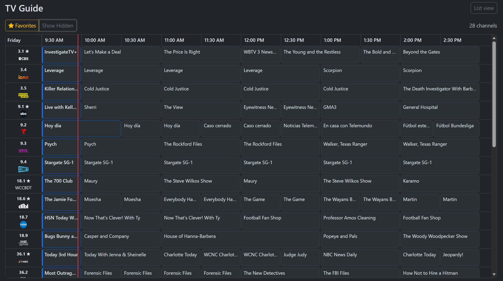
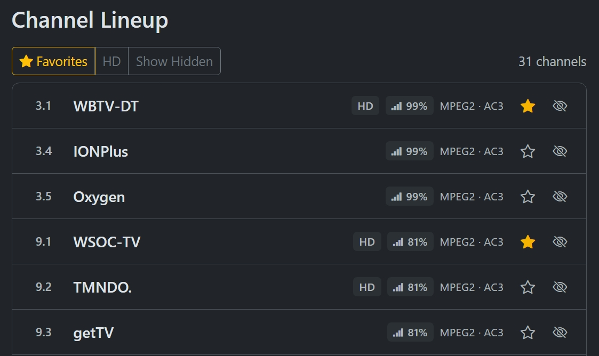
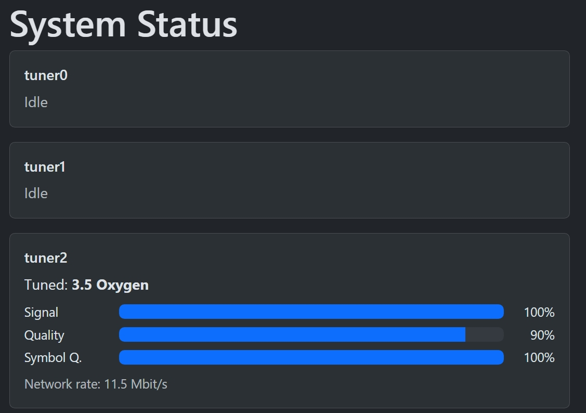
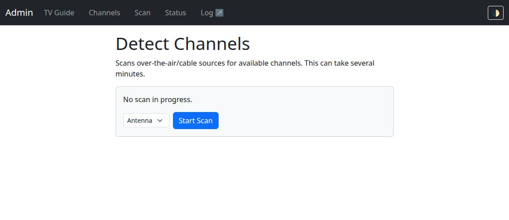

# LunaTV

A mobile-first web client for watching and browsing live TV off your [HDHomeRun](https://www.silicondust.com/) tuner, plus an admin panel for device setup/management that's a friendlier alternative to the device's own built-in web interface. It talks to your HDHomeRun over its local HTTP API and runs as a small self-hosted Docker container.

This repo also includes a sideloadable [Roku client](roku/) for watching live TV on your TV, powered by the same server.

## Features

### Client (mobile-first, the default landing page)

- **TV Guide** (`/`, also `/guide`) — live program guide (titles, times, episode info, synopses, artwork) via Silicondust's cloud Guide API, authenticated using the device's own `DeviceAuth` token. No subscription required. A large one-tap Watch button per channel starts playback immediately; tap the row itself to expand upcoming programs. A denser cable-style channel × time grid with a live "now" line is also available at `/guide/grid` for desktop use.
- **Watch Live TV** — tapping Watch opens the video in a full-screen overlay right on the guide page, not a separate page load; closing it (✕, Escape, or the device Back gesture) drops you back exactly where you were, guide scroll position and filters intact. The HDHomeRun outputs raw MPEG2/AC3 that browsers can't decode natively, so the app transcodes it on the fly to H.264/AAC HLS using Intel Quick Sync (QSV) hardware acceleration, and plays it back with [hls.js](https://github.com/video-dev/hls.js) (native HLS on iOS Safari), including closed captions, with autoplay (falling back to muted autoplay if the browser blocks sound). Typically starts playing within a few seconds; tuner sessions are released automatically ~20s after you stop watching.
- **DVR recordings** (`/recordings`) — browse completed recordings from an optional [HDHomeRun RECORD](https://info.hdhomerun.com/info/dvr) engine, play them in-browser through the same QSV H.264/AAC HLS pipeline as live TV, and permanently delete individual recordings after confirmation.
- **Record this airing** — an optional "Record" button on the watch screen that schedules a one-off recording of whatever's currently playing. Requires a separately-run HDHomeRun RECORD engine (Silicondust's DVR software — not something this app manages or containers) reachable via `RECORD_ENGINE_HOST`; DVR controls are hidden entirely if that's not configured. See [Configuration](#configuration) below.
- Add the site to your iOS/Android home screen (`Share → Add to Home Screen`) for an app-like icon and full-screen launch — no App Store needed.

### Admin (`/admin`, linked via the small gear icon in the client header)

- **System Menu** (`/admin`) — device info at a glance: friendly name, model, firmware version, device ID, tuner count. Includes a link to the device's own system log.
- **Channel Lineup** (`/admin/channels`) — full channel list including hidden and unsubscribed channels, with per-channel signal strength/quality and codec info. Toggle filters for Favorites, HD, and Show Hidden, plus one-tap buttons to favorite or hide any channel (synced back to the device itself).
- **Detect Channels** (`/admin/scan`) — start or abort a channel scan, with a source selector (e.g. Antenna/Cable) and live progress.
- **System Status** (`/admin/status`) — per-tuner status: currently tuned channel, signal strength/quality meters, and network rate (Mbit/s), auto-refreshing.
- **Light/dark mode** toggle in the admin navbar, remembered across visits. (The client pages are dark-only, matching the Roku app's branding.)

### Roku

- **Roku client** (`roku/`) — a sideloadable Roku app that talks to this same server:
  - Live channel preview in the guide (a small tuned thumbnail as you browse rows, debounced so it doesn't tune every channel you scroll past; shows the current program's artwork while loading or if you turn preview off, instead of a black box). Can be disabled entirely in Settings for systems with few tuners.
  - Recently-watched channels pinned to the top of the guide.
  - A now/next info overlay during playback (press OK or `*`/Options) showing what's on and what's up next.
  - Closed captions.
  - Three codec/streaming modes, switchable in Settings: `h264`/`hevc` transcode (same QSV pipeline as the browser client) or an experimental no-transcode **Direct** mode (`-c copy` remux) — Direct is also currently the only mode that plays ATSC 3.0 (NextGen TV, HEVC Main10 + AC-4) channels; the transcode modes don't support ATSC 3.0 sources yet.

  See [roku/README.md](roku/README.md) for setup and sideloading instructions.

## Screenshots

| TV Guide | Watching |
|---|---|
|  |  |

| Channel Lineup | System Status | Detect Channels |
|---|---|---|
|  |  |  |

| Roku channel guide |
|---|
|  |

## Stack

- Node.js + Express, server-rendered with EJS (no SPA build step)
- [htmx](https://htmx.org/) for the small bits of live-updating UI (scan progress, tuner status, favorite/hide toggles)
- [Bootstrap 5](https://getbootstrap.com/) for styling, loaded via CDN, with a light/dark theme toggle
- [hls.js](https://github.com/video-dev/hls.js) for in-browser playback of the transcoded live stream
- [jellyfin-ffmpeg](https://github.com/jellyfin/jellyfin-ffmpeg) for QSV-accelerated transcoding (bundles its own current Intel media driver — see [Hardware transcoding](#hardware-transcoding-live-tv) below)
- Talks directly to your HDHomeRun's HTTP API (`discover.json`, `lineup.json`, `lineup.post`, `lineup_status.json`, `status.json`, plus the raw video stream on port `5004`)
- Talks to Silicondust's cloud Guide API (`api.hdhomerun.com`) for program guide data

## Running

```bash
docker compose up -d --build
```

The app listens on port `8080` by default — visit `http://<docker-host>:8080`.

### Configuration

Configuration lives in a `.env` file (read automatically by `docker compose`). Copy the example and edit it:

```bash
cp .env.example .env
```

| Variable          | Default          | Notes                                                                 |
|-------------------|------------------|------------------------------------------------------------------------|
| `HDHOMERUN_HOST`  | —                | **Use your device's LAN IP, not its `.local` mDNS name.** Containers on the default Docker bridge network can't resolve mDNS names. |
| `HDHOMERUN_PORT`  | `80`             | HDHomeRun's HTTP port.                                                |
| `PORT`            | `8080`           | Port the web app listens on inside the container.                    |
| `STREAM_DECODE_MODE` | `qsv`         | Decode mode for live transcode input: `qsv` (default) or `sw` (software decode + hardware encode). Useful for CC A/B testing. |
| `WEBVTT_SIDECAR_MODE` | `on`         | Enables experimental WebVTT sidecar extraction for browser captions. Set `off` to disable sidecar track generation. |
| `SOURCE_CAPTION_PROBE` | `off`       | Enables raw-input ffprobe caption probing in diagnostics. Keep `off` unless actively debugging caption ingest. |
| `RECORD_ENGINE_HOST` | —          | Optional. LAN IP/hostname of a separately-run [HDHomeRun RECORD](https://info.hdhomerun.com/info/dvr) engine — enables recording, browsing, playback, and deletion at `/recordings`. Leave unset to disable DVR controls. Must be a LAN address, not `localhost`, even if the engine runs on the same machine — same reasoning as `HDHOMERUN_HOST` above. |
| `RECORD_ENGINE_PORT` | `37899`     | Port the RECORD engine's local HTTP API listens on. |

You can find your device's current IP via its own web UI, your router's DHCP client list, or `avahi-resolve -n hdhomerun.local` on a machine with mDNS support. A DHCP reservation for the device is recommended so the IP doesn't change.

### Hardware transcoding (live TV)

Watching a channel requires an Intel iGPU with Quick Sync Video (QSV) support on the Docker host, passed through to the container. `docker-compose.yml` already maps `/dev/dri` in; there's nothing else to configure for a standard setup.

If you hit issues (stream never starts, or `docker compose logs` shows VAAPI/QSV errors), it's almost always the media driver:

- Newer Intel iGPUs (e.g. N100/N150 "Alder Lake-N"/"Twin Lake") aren't recognized by the media driver version shipped in Debian's stable repos — VAAPI init fails outright. This is why the image installs [`jellyfin-ffmpeg`](https://github.com/jellyfin/jellyfin-ffmpeg) instead of stock `ffmpeg`: it bundles its own current Intel media driver rather than relying on the OS package.
- You can sanity-check hardware acceleration directly: `docker compose exec hdhomerun-web ffmpeg -hwaccel qsv -hwaccel_output_format qsv -c:v mpeg2_qsv -i "http://<device-ip>:5004/auto/v<channel>" -c:v hevc_qsv -f null -` should report `va_openDriver() returns 0` and start encoding frames.
- No Intel GPU (or a system that doesn't support QSV) means live playback won't work; everything else in the app (guide, lineup, scan, status) is unaffected.

### Closed captions (browser)

Browser CC currently uses an experimental WebVTT sidecar path generated per
active stream session.

- Keep `WEBVTT_SIDECAR_MODE=on` to expose a browser caption track.
- If captions are not appearing, test with `STREAM_DECODE_MODE=sw` for
  comparison while keeping hardware encode enabled.
- Use `SOURCE_CAPTION_PROBE=on` only when you need raw input-vs-output caption
  diagnostics; it is intentionally off by default to reduce noise.

## Local development (without Docker)

```bash
npm install
HDHOMERUN_HOST=<device-ip> npm start
```

Live TV playback needs `ffmpeg` on your `PATH` with QSV support available (see above) — everything else works without it.

## Project layout

```
server.js              Express app entrypoint
src/hdhomerun.js        Client for the HDHomeRun HTTP API
src/guide.js            Client for Silicondust's cloud Guide API
src/stream.js           Manages per-channel ffmpeg/HLS transcode sessions
src/routes/            Route handlers (HTML pages + /api/* JSON)
views/                 EJS templates (server-rendered)
public/                Static assets (CSS, favicon)
roku/                  Roku (BrightScript/SceneGraph) client - see roku/README.md
```

### JSON API

Alongside the HTML pages, the server exposes JSON used by the Roku client (and
useful for any other client):

| Endpoint | Purpose |
|---|---|
| `GET /api/guide` | Channels with now/next programs, pre-shaped for a TV guide: non-overlapping program times, unsubscribed/hidden channels filtered out, no null fields. |
| `POST /stream/<ch>/start` | Begin tuning + transcoding a channel (returns 202 immediately). |
| `GET /stream/<ch>/ready` | `{"ready":bool,"failed":bool,"error":"..."}` — poll until ready. |
| `GET /stream/<ch>/stream.m3u8` | The HLS playlist, once ready. |
