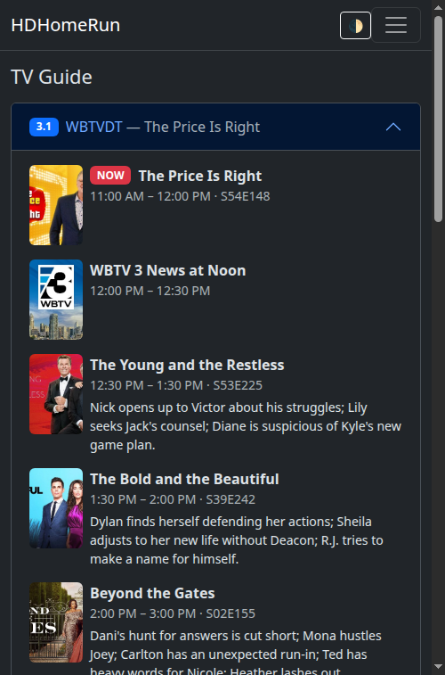
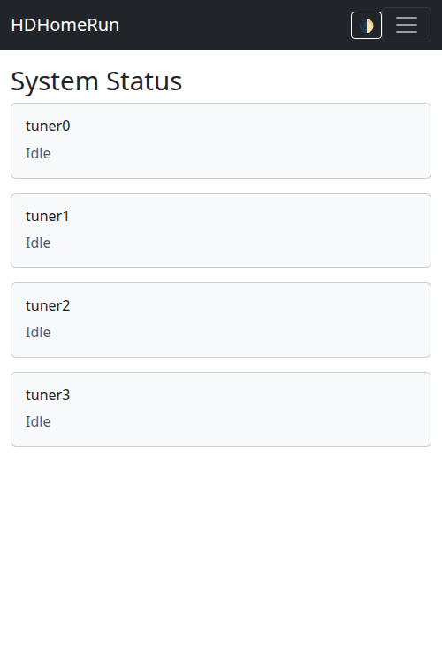
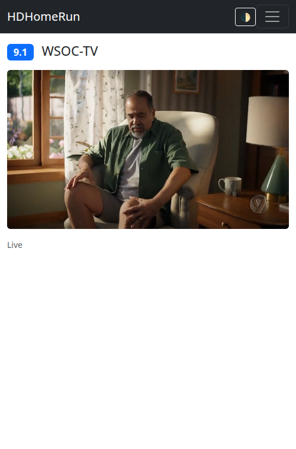
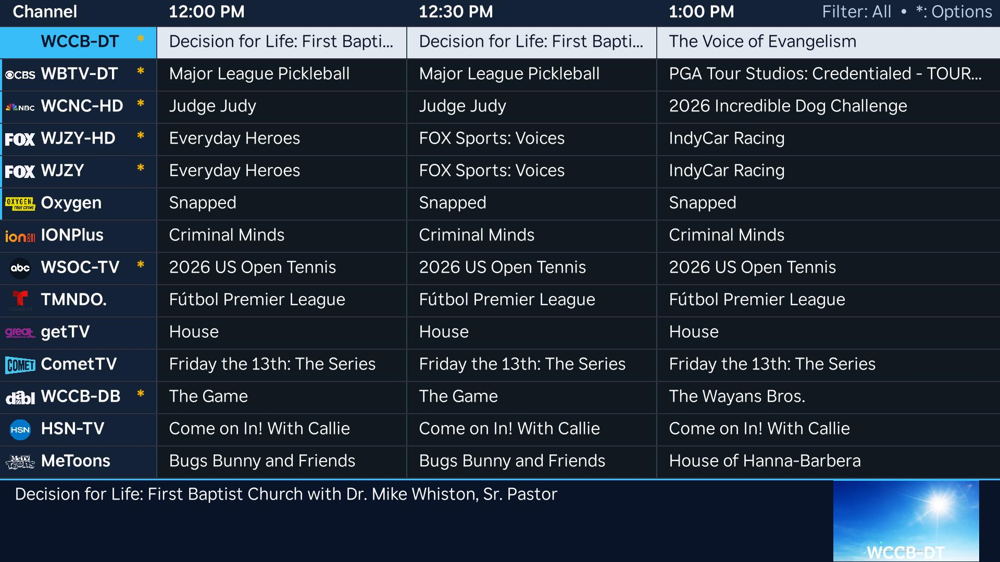

# hdhomerun-web

A mobile-responsive web UI for managing your [HDHomeRun](https://www.silicondust.com/) device, meant as a friendlier alternative to the device's built-in web interface. It talks to your HDHomeRun over its local HTTP API and runs as a small self-hosted Docker container.

This repo also includes a sideloadable [Roku client](roku/) for watching live TV on your TV, powered by the same server.

## Features

- **System Menu** (`/`) — device info at a glance: friendly name, model, firmware version, device ID, tuner count. Includes a link to the device's own system log.
- **TV Guide** — live program guide (titles, times, episode info, synopses, artwork) via Silicondust's cloud Guide API, authenticated using the device's own `DeviceAuth` token. No subscription required. Two views: a cable-style channel × time grid (`/guide/grid`) with a live "now" line — tap any program to start watching — and a per-channel list (`/guide`).
- **Watch Live TV** (`/watch/:channel`) - plays a channel directly in the browser. The HDHomeRun outputs raw MPEG2/AC3 that browsers can't decode natively, so the app transcodes it on the fly to HEVC/AAC HLS using Intel Quick Sync (QSV) hardware acceleration, and plays it back with [hls.js](https://github.com/video-dev/hls.js). Typically starts playing within a few seconds; tuner sessions are released automatically ~20s after you stop watching.
- **Channel Lineup** (`/channels`) — full channel list including hidden and unsubscribed channels, with per-channel signal strength/quality and codec info. Toggle filters for Favorites, HD, and Show Hidden, plus one-tap buttons to favorite or hide any channel (synced back to the device itself).
- **Detect Channels** (`/scan`) — start or abort a channel scan, with a source selector (e.g. Antenna/Cable) and live progress.
- **System Status** (`/status`) — per-tuner status: currently tuned channel, signal strength/quality meters, and network rate (Mbit/s), auto-refreshing.
- **Light/dark mode** toggle in the navbar, remembered across visits.
- **Roku client** (`roku/`) — a sideloadable Roku app that talks to this same server: now/next channel guide and live playback on your TV. See [roku/README.md](roku/README.md) for setup and sideloading instructions.

## Screenshots

| TV Guide grid (dark) | System Status (light) | Watching live TV |
|---|---|---|
|  |  |  |

| Roku channel guide |
|---|
|  |

## Stack

- Node.js + Express, server-rendered with EJS (no SPA build step)
- [htmx](https://htmx.org/) for the small bits of live-updating UI (scan progress, tuner status, favorite/hide toggles)
- [Bootstrap 5](https://getbootstrap.com/) for styling, loaded via CDN, with a light/dark theme toggle
- [hls.js](https://github.com/video-dev/hls.js) for in-browser playback of the transcoded live stream
- [jellyfin-ffmpeg](https://github.com/jellyfin/jellyfin-ffmpeg) for QSV-accelerated transcoding (bundles its own current Intel media driver — see [Hardware transcoding](#hardware-transcoding-live-tv) below)
- Talks directly to your HDHomeRun's HTTP API (`discover.json`, `lineup.json`, `lineup.post`, `lineup_status.json`, `status.json`, plus the raw video stream on port `5004`)
- Talks to Silicondust's cloud Guide API (`api.hdhomerun.com`) for program guide data

## Running

```bash
docker compose up -d --build
```

The app listens on port `8080` by default — visit `http://<docker-host>:8080`.

### Configuration

Configuration lives in a `.env` file (read automatically by `docker compose`). Copy the example and edit it:

```bash
cp .env.example .env
```

| Variable          | Default          | Notes                                                                 |
|-------------------|------------------|------------------------------------------------------------------------|
| `HDHOMERUN_HOST`  | —                | **Use your device's LAN IP, not its `.local` mDNS name.** Containers on the default Docker bridge network can't resolve mDNS names. |
| `HDHOMERUN_PORT`  | `80`             | HDHomeRun's HTTP port.                                                |
| `PORT`            | `8080`           | Port the web app listens on inside the container.                    |

You can find your device's current IP via its own web UI, your router's DHCP client list, or `avahi-resolve -n hdhomerun.local` on a machine with mDNS support. A DHCP reservation for the device is recommended so the IP doesn't change.

### Hardware transcoding (live TV)

Watching a channel requires an Intel iGPU with Quick Sync Video (QSV) support on the Docker host, passed through to the container. `docker-compose.yml` already maps `/dev/dri` in; there's nothing else to configure for a standard setup.

If you hit issues (stream never starts, or `docker logs hdhomerun-web` shows VAAPI/QSV errors), it's almost always the media driver:

- Newer Intel iGPUs (e.g. N100/N150 "Alder Lake-N"/"Twin Lake") aren't recognized by the media driver version shipped in Debian's stable repos — VAAPI init fails outright. This is why the image installs [`jellyfin-ffmpeg`](https://github.com/jellyfin/jellyfin-ffmpeg) instead of stock `ffmpeg`: it bundles its own current Intel media driver rather than relying on the OS package.
- You can sanity-check hardware acceleration directly: `docker exec hdhomerun-web ffmpeg -hwaccel qsv -hwaccel_output_format qsv -c:v mpeg2_qsv -i "http://<device-ip>:5004/auto/v<channel>" -c:v hevc_qsv -f null -` should report `va_openDriver() returns 0` and start encoding frames.
- No Intel GPU (or a system that doesn't support QSV) means live playback won't work; everything else in the app (guide, lineup, scan, status) is unaffected.

## Local development (without Docker)

```bash
npm install
HDHOMERUN_HOST=<device-ip> npm start
```

Live TV playback needs `ffmpeg` on your `PATH` with QSV support available (see above) — everything else works without it.

## Project layout

```
server.js              Express app entrypoint
src/hdhomerun.js        Client for the HDHomeRun HTTP API
src/guide.js            Client for Silicondust's cloud Guide API
src/stream.js           Manages per-channel ffmpeg/HLS transcode sessions
src/routes/            Route handlers (HTML pages + /api/* JSON)
views/                 EJS templates (server-rendered)
public/                Static assets (CSS, favicon)
roku/                  Roku (BrightScript/SceneGraph) client - see roku/README.md
```

### JSON API

Alongside the HTML pages, the server exposes JSON used by the Roku client (and
useful for any other client):

| Endpoint | Purpose |
|---|---|
| `GET /api/guide` | Channels with now/next programs, pre-shaped for a TV guide: non-overlapping program times, unsubscribed/hidden channels filtered out, no null fields. |
| `POST /stream/<ch>/start` | Begin tuning + transcoding a channel (returns 202 immediately). |
| `GET /stream/<ch>/ready` | `{"ready":bool,"failed":bool,"error":"..."}` — poll until ready. |
| `GET /stream/<ch>/stream.m3u8` | The HLS playlist, once ready. |
