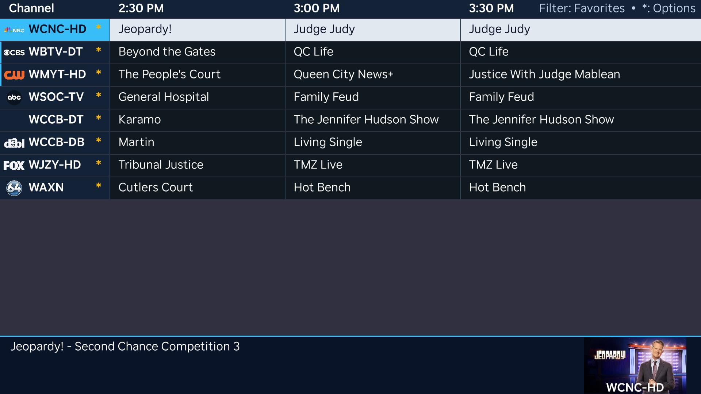

A Roku app for the LunaTV server: browse a now/next channel guide and
watch live TV on your TV. It's a thin client: the server does all the tuning
and transcoding, and the Roku just plays the resulting HLS stream.

## Screenshots

### Channel guide



The guide shows the active channel filter, current and upcoming programs, and
details for the focused program. The preview area is intentionally not used as
a playback indicator in documentation: Roku developer screenshots capture the
SceneGraph UI layer but not the hardware video plane.

> **This is meant to be sideloaded, not published.** Roku discontinued private
> (non-certified) channels in February 2022. The replacement, Beta Channels,
> expires after 120 days and caps at 20 installs — not useful for a personal
> app. Sideloading via Developer Mode needs no Roku review or approval, and is
> what these instructions cover.

## Requirements

- The `hdhomerun-web` server running and reachable from your Roku (same LAN)
- A Roku device you can put into Developer Mode
- `zip` and `curl` on the machine you deploy from

## 1. Enable Developer Mode on the Roku

On the Roku remote, from the home screen, press:

```
Home ×3, Up ×2, Right, Left, Right, Left, Right
```

A Developer Settings screen appears. Choose **Enable developer mode**, accept the
license, and set a password. **Write this password down** — it isn't recoverable
and it is *not* your Roku account password. The device reboots.

After it reboots, note the IP shown on that screen (also in
*Settings → Network → About*).

## 2. Point the app at your server

Set the server URL in `roku/.env`:

```bash
HDHOMERUN_WEB_URL=http://192.168.1.100:8080
```

`deploy.sh` embeds this URL into the packaged app. You can also change it at
runtime from the app (**Options / `*`** on the guide screen, then Settings).
The value saved to the Roku registry takes precedence over the packaged URL.

## 3. Deploy

```bash
cd roku
cp .env.example .env      # then edit it
./deploy.sh
```

`.env` holds your device details:

```bash
ROKU_IP=192.168.1.50
ROKU_DEV_PASSWORD=your-developer-mode-password
HDHOMERUN_WEB_URL=http://192.168.1.100:8080
```

Or pass them inline:

```bash
ROKU_IP=192.168.1.50 ROKU_DEV_PASSWORD=hunter2 ./deploy.sh
```

The app then appears on the Roku home screen as **LunaTV**.

To build the zip without uploading (e.g. to install by hand through the web UI
at `http://<roku-ip>`, user `rokudev`):

```bash
./deploy.sh --package-only
```

## 4. Using the app

- **Guide:** Left selects All channels; Right selects Favorites. Recently
  watched channels are pinned at the top, while the guide preserves your
  focused channel when that ordering changes.
- **Settings:** Press **Options / `*`** on the guide. Press **OK** to edit and
  test the server URL; **Left/Right** cycles H.264, HEVC, and Direct streaming
  modes; **Up/Down** toggles live preview. These choices are saved on the Roku.
  H.264 is the default and supports closed captions. HEVC is more efficient but
  does not carry captions. Direct skips transcoding and is experimental.
- **Live preview:** A small H.264 preview starts after guide focus settles. It
  is best effort and uses a tuner while playing; turn it off in Settings if
  tuner capacity is limited.
- **Live TV:** Press **OK** or **Options** for the channel/program info bar,
  **Rewind/Fast Forward** to surf visible guide channels, and **Up** to toggle
  the diagnostics overlay.
- **DVR:** Press **Play** on the guide to open recordings. Press **OK** to play
  a recording, **Options** to delete a completed recording or stop an active
  one, and **Back** to return. Active entries are labeled `RECORDING NOW` and
  refresh every 15 seconds. Stopping discards the partial recording. While
  watching live TV, press **Down** to schedule the current airing; a notice and
  `REC` badge confirm a successful request. DVR requires the server's
  `RECORD_ENGINE_HOST` configuration.

## 5. Debugging

BrightScript errors and any `print` output go to the debug console:

```bash
telnet <roku-ip> 8085
```

Worth knowing: playback and tuning failures are deliberately logged in full
there, while the on-screen message is kept short — the server's error field can
carry several KB of ffmpeg output that would be unreadable on a TV.

While watching live TV, press **Up** on the remote to toggle a diagnostics
overlay. It shows stream codec/profile/target bitrate plus live ffmpeg metrics
(fps/speed/bitrate) and tuner signal telemetry when available.

## Things to know

- **Only one sideloaded app can exist on a Roku at a time.** Installing this
  replaces any other dev channel on the device.
- **Re-uploading an identical build is rejected** with "Identical to previous
  version". Bump `build_version` in [`manifest`](manifest) to force it.
- **Sideloaded apps and Developer Mode are widely reported to survive reboots,
  but Roku doesn't actually document that guarantee.** Some users report needing
  to re-sideload after firmware updates. If the app disappears, re-running
  `./deploy.sh` takes a few seconds.
- **Tuner limits still apply.** Each channel you open starts an ffmpeg session on
  the server and occupies a physical tuner. The server releases it ~20 seconds
  after you stop watching, so rapid channel-flipping can briefly hold several.

## How it works

```
Roku app                     hdhomerun-web server              HDHomeRun
   |                                  |                             |
   |-- GET /api/guide --------------->|-- cloud Guide API           |
   |<-- channels + now/next ----------|                             |
   |                                  |                             |
   |-- POST /stream/3.1/h264/start -->|-- spawn ffmpeg (QSV) ------->| tune
   |-- GET  /stream/3.1/h264/ready -->|   (poll every 500ms)         |
   |<-- {"ready":true} ---------------|                             |
   |                                  |                             |
   |-- GET /stream/3.1/h264/          |   MPEG2/AC3 -> H.264/AAC HLS |
   |       stream.m3u8 -------------->|                             |
   |<== HLS segments =================|<============================|
```

The start/poll handshake exists because the HLS playlist doesn't exist until
ffmpeg has spun up (typically 2–4s). Pointing the Video node at the `.m3u8`
before then fails. Don't collapse those steps.

H.264 is the default because it is broadly compatible and supports closed
captions. Settings can select HEVC for better efficiency, or experimental
Direct mode, which remuxes the tuner's source without transcoding. Direct can
help with ATSC 3.0 sources, but raw MPEG-TS/HLS codec support varies by Roku
model and is not guaranteed.

## Layout

```
manifest                     app metadata, icons, splash
source/main.brs              entry point
components/
  MainScene.*                screen stack and persisted server/stream settings
  GuideScreen.*              compact multi-column channel guide
  GuideRow.*                 custom guide row renderer
  PlayerScreen.*             Video node, program info, diagnostics, DVR badge
  SettingsScreen.*           server URL, streaming mode, and preview settings
  RecordingsScreen.*         DVR list, active-state refresh, and actions
  RecordingPlayerScreen.*    recorded HLS playback
  GuideTask.*                fetches /api/guide off the render thread
  RecordingsTask.*           fetches, deletes, and stops recordings off the render thread
  RecordingStreamTask.*      starts/polls recorded HLS off the render thread
  RecordCurrentTask.*        schedules the current airing off the render thread
  StreamStartTask.*          start/poll handshake off the render thread
  StreamStatsTask.*          fetches live stream and tuner diagnostics
  UrlCheckTask.*             validates a saved server URL off the render thread
  Net.brs                    shared roUrlTransfer helpers
```

All network I/O lives in Task nodes — SceneGraph forbids blocking the render
thread, and doing so is the usual cause of an app that hangs on launch.
